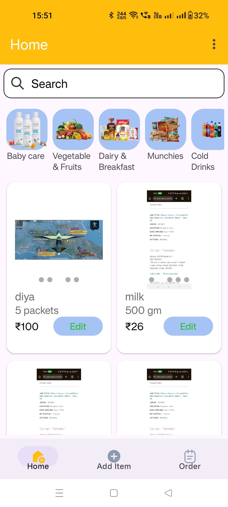
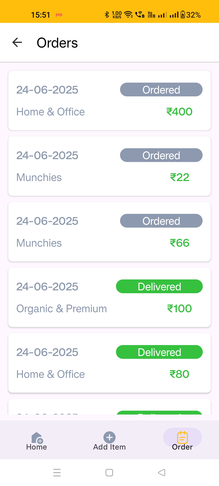
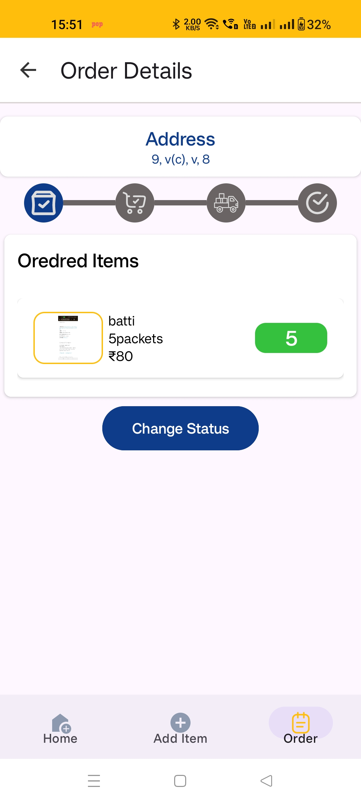
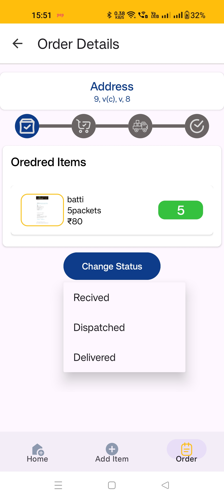
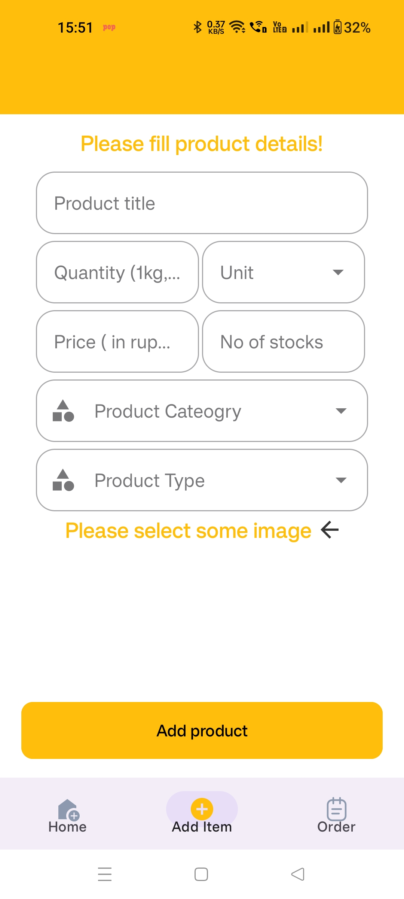

# TurboMart Admin

## Overview
TurboMart Admin is a powerful Android application designed for administrators to manage an online grocery and essentials store. The app provides a seamless interface for adding, editing, and managing products, categories, and orders, all in real-time using Firebase as the backend. It is inspired by modern e-commerce admin panels and is built to be fast, intuitive, and secure.

## Video demo
[](https://youtu.be/LZ-4i0Wlfh0)

## Features
- **Admin Authentication**: Secure phone number-based login with OTP verification.
- **Product Management**: Add, edit, and delete products with multiple images, categories, units, and types.
- **Category Management**: Organize products into various categories for easy browsing.
- **Order Management**: View, update, and track customer orders with real-time status changes and notifications.
- **Search & Filter**: Powerful search and filtering for products by name, price, category, and type.
- **Real-time Notifications**: Send and receive order status notifications using Firebase Cloud Messaging.
- **Modern UI**: Clean, responsive, and user-friendly interface with smooth navigation and dialogs.

## Tech Stack
- **Kotlin** (Android)
- **MVVM Architecture**
- **Firebase Authentication**
- **Firebase Realtime Database**
- **Firebase Cloud Messaging**
- **Retrofit** (for API calls)
- **Coroutines & LiveData**

## Screenshots
Below are some screenshots of the TurboMart Admin app in action:

 

<br/>




> _Replace these images with your actual screenshots in the `screenshots` folder._

## Folder Structure
```
TurboMartAdmin/
├── app/
│   ├── src/
│   │   ├── main/
│   │   │   ├── java/com/example/admindiyabatti/  # Main source code
│   │   │   ├── res/                              # Resources (layouts, drawables, etc.)
│   │   │   └── AndroidManifest.xml
│   └── google-services.json
├── screenshots/                                  # Place your screenshots here
├── build.gradle.kts
└── ...
```


## License
[MIT](LICENSE)

---

> **TurboMart Admin** – Manage your online store with ease! 
